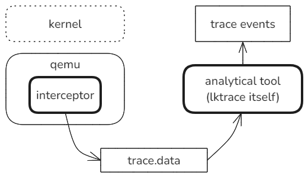

# lktrace

A VMI trace tool for analysing kernel.



There're two parts:

1. Qemu interceptor: **Modified qemu** which can intercept the running events of guest kernel and dump.
2. Analytical tool: parse the dumped data file and observe the inner behavior of the kernel at a higher level.

## Quick Start

### 1. Build qemu with interceptor

```sh
mkdir build
cd build
../configure --target-list=riscv64-softmmu
make
```

### 2. Install qemu with interceptor

Add the path of qemu into $PATH.

```sh
export PATH=/home/cloud/gitWork/qemu/build/:$PATH
```

Note: re-enter the terminal or `source ~/.bashrs` to make it work.

### 3. Build & install analytical tool

```sh
cd lktrace
make
make install
```

### 4. Use it to analyse kernel

Run linux or lkmodel on qemu with interceptor and get a file `lk_trace.data` at $CWD.

Use tool lktrace to parse the binary data file.

```sh
lktrace path/to/lk_trace.data
```

Then get output on screen:

```console
Task[0xffffffc0805be038] ========>
[0]: clone(0x1200011, 0x0, 0x0, 0x0, 0x3ff7ea66d0) -> 0x0, usp: 0x3ffffffa40
[1]: set_robust_list(0x3ff7ea66e0, 0x18) -> OK, usp: 0x3ffffffa40
[2]: faccessat(AT_FDCWD, "/proc/self/oom_score_adj", 0x0) -> ENOENT, usp: 0x3ffffffad0
... ...
[8]: sys_154(0x0, 0x0, 0x0, 0x0, 0x0, 0xffffffffffffffff, 0x0) -> 0x0, usp: 0x3ffffffb40
[9]: clock_gettime(0x0, 0x3ffffffb08) -> OK, usp: 0x3ffffffb00
[10]: clock_gettime(0x1, 0x2aaaaec3e0) -> OK, usp: 0x3ffffffaf0
... ...
[16]: getpid() -> 0x5, usp: 0x3ffffffb60
[17]: clock_gettime(0x1, 0x2aaaaec3e0) -> OK, usp: 0x3ffffffaf0
[18]: getppid() -> 0x4, usp: 0x3ffffffb60
[19]: getppid() -> 0x4, usp: 0x3ffffffb60
[20]: kill(0x4, 0xa) -> 0x0, usp: 0x3ffffffb70

Task sequence:
0xffffffc080373018
0xffffffc080393038
0xffffffc0803b3058
0xffffffc08059e018
0xffffffc0805be038
```
